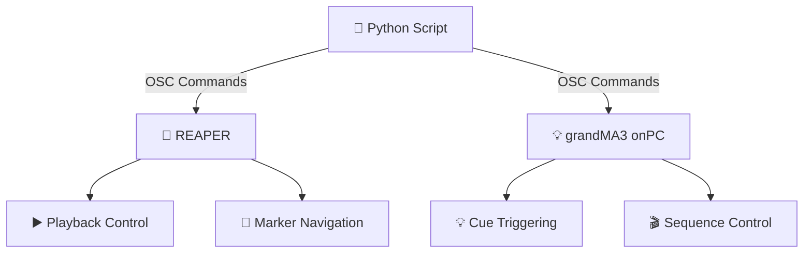
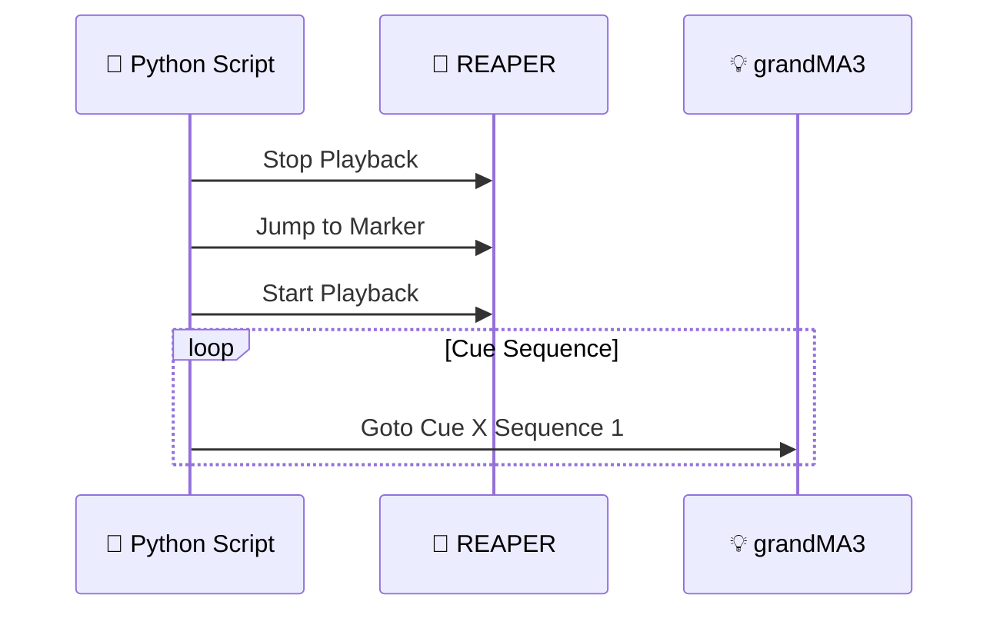
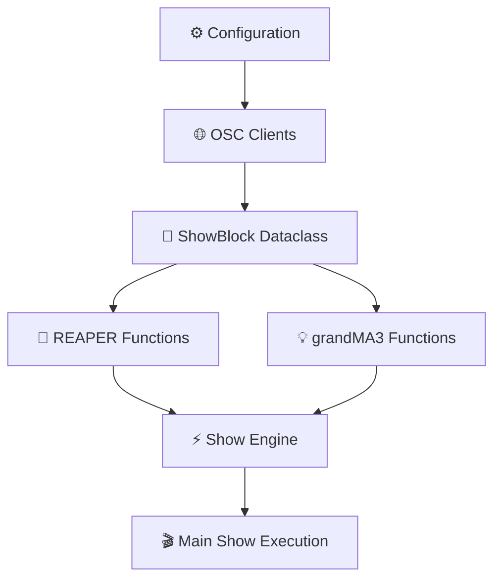
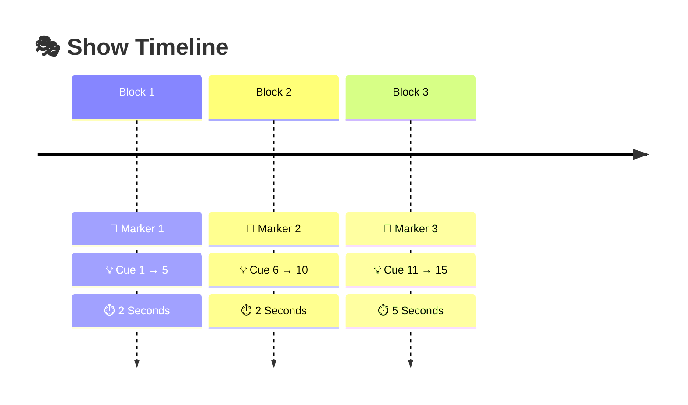
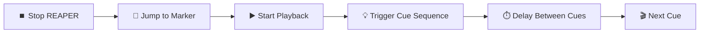
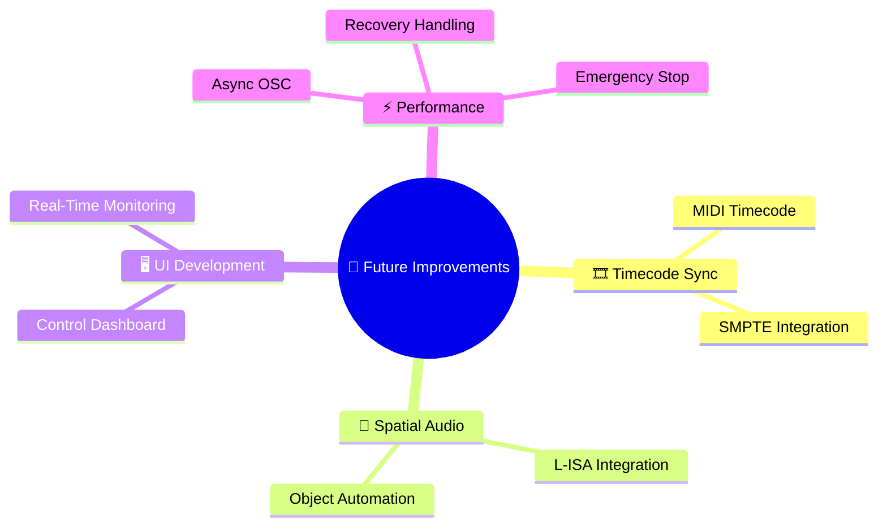

# 🎭 OSC-Based Multimedia Show Control System

> Synchronizing audio playback and lighting control using  
> **Python + REAPER + grandMA3 onPC**

---

# 🚀 Project Overview

This project demonstrates a lightweight multimedia show control system using:

- 🎵 REAPER for audio playback
- 💡 grandMA3 onPC for lighting control
- 🐍 Python for automation and OSC communication

The system automates:
- audio playback
- timeline navigation
- lighting cue execution
- sequential show blocks

using **OSC (Open Sound Control)** over localhost.

---

# 🖥️ System Architecture



---

# 🌐 Communication Flow



---

# ✨ Core Features

## 🎵 REAPER Integration

The script can:

- ▶️ Start playback
- ⏹️ Stop playback
- 📍 Jump to timeline markers

using REAPER OSC action commands.

Example:

```python
reaper.send_message("/action/1007", 1.0)
```

---

## 💡 grandMA3 Cue Control

Lighting cues are triggered directly through OSC commands:

```text
Goto Cue X Sequence 1
```

Example:

```python
gma3.send_message("/gma3/cmd", "Goto Cue 5 Sequence 1")
```

---

# 🧩 Block-Based Show Programming

The show is divided into programmable blocks.

Each block contains:
- 📍 REAPER marker
- 💡 starting cue
- 💡 ending cue
- ⏱️ duration

Example:

```python
ShowBlock(
    marker=1,
    start_cue=1,
    end_cue=5,
    duration=2
)
```

---

# 🛠️ Software Stack

| Software | Purpose |
|---|---|
| 🎵 REAPER | Audio playback and timeline control |
| 💡 grandMA3 onPC | Lighting cue execution |
| 🐍 Python | Automation and scripting |
| 📡 python-osc | OSC networking library |

---

# 📚 Python Library

## 📡 python-osc

Used for communication between:
- REAPER
- grandMA3
- Python

Install using:

```bash
pip install python-osc
```

---

# 🧠 Code Structure



---

# 🎬 Example Show Flow



---

# ⚡ Show Execution Flow



---

# ✅ Advantages

## ⚡ Simple Architecture

Uses:
- one laptop
- localhost networking
- lightweight automation

This reduces:
- hardware complexity
- setup time
- synchronization delay

---

## 🚀 Fast Development Workflow

The block structure allows:
- rapid testing
- quick cue adjustments
- modular show programming

---

## 🎛️ Flexible Control

Lighting and audio can be modified independently while maintaining synchronized playback.

---

# ⚠️ Current Limitations

The current system uses:

```python
time.sleep()
```

for timing control.

This can introduce:
- ⌛ timing drift
- 🖥️ OS scheduling delay
- ⚠️ non-frame-accurate synchronization

For professional-grade synchronization:
- MIDI Timecode (MTC)
- SMPTE Timecode

would provide significantly higher precision.

---

# 🔮 Future Improvements



---

# 🏁 Conclusion

This project demonstrates a compact OSC-based multimedia show control workflow integrating:

- 🎵 REAPER
- 💡 grandMA3 onPC
- 🐍 Python automation

The system provides:
- synchronized playback
- automated lighting control
- scalable show sequencing
- efficient multimedia integration

suitable for:
- 🎓 educational showcases
- 🎭 multimedia performances
- 🧪 experimental installations
- 🎬 small-scale live productions